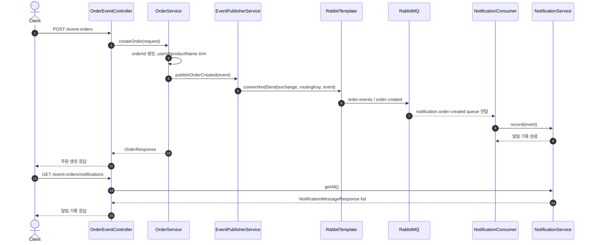
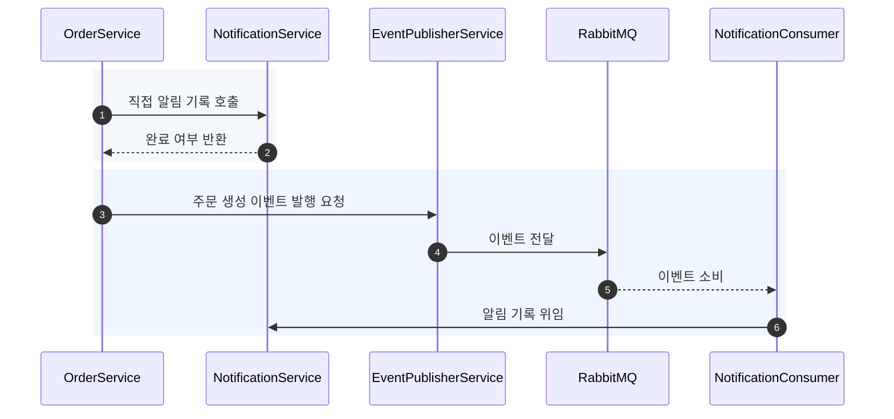

# 이론 정리

> 이 문서는 참고 구현을 기준으로 `POST /event-orders` 주문 생성, `OrderCreatedEvent` 발행, `NotificationConsumer` 소비, `GET /event-orders/notifications` 확인 흐름을 설명합니다. 목표는 RabbitMQ 사용법 자체보다 발행자와 소비자의 책임 경계를 읽고 비교하는 것입니다.

## 1. Problem - 왜 이벤트 기반 사고가 필요한가

주문 생성 뒤 알림을 남기는 기능은 처음에는 한 메서드 안에서 처리해도 작동합니다. 하지만 후속 작업이 알림, 로그, 분석, 포인트 적립으로 늘어나면 주문 서비스가 각 작업의 호출 방식과 실패 처리를 모두 알게 됩니다.

이 구조에서는 주문 생성 책임과 후속 처리 책임이 섞입니다. 요청 응답은 주문 생성 성공만 알려야 하는지, 알림 기록까지 완료되어야 하는지, 발행 실패를 어떻게 볼지 같은 질문도 함께 생깁니다.

참고 구현은 주문 생성 결과를 `OrderCreatedEvent`로 표현하고, `EventPublisherService`와 `NotificationConsumer`를 분리해 발행자와 소비자의 책임을 나눕니다.

## 2. Analyze - 참고 구현에서 선택한 구조 기준

이벤트 기반 구조는 직접 호출을 모두 대체하는 방식이 아닙니다. 이번 구현은 "현재 요청 응답에 후속 알림 결과가 직접 필요하지 않다"는 조건에서 이벤트 전달을 선택합니다.

| 판단 기준 | 참고 구현의 선택 | 리뷰할 지점 |
|---|---|---|
| 요청 응답 | `OrderResponse`는 주문 생성 결과만 반환합니다. | 알림 소비 결과를 주문 응답에 섞지 않았는지 봅니다. |
| 이벤트 payload | `OrderCreatedEvent`는 주문 id, 사용자 id, 상품명, 메시지만 담습니다. | 소비에 필요한 최소 사실인지 확인합니다. |
| 발행 책임 | `EventPublisherService`가 exchange와 routing key로 발행합니다. | 발행자가 소비자 내부 정책을 알지 않는지 봅니다. |
| 소비 책임 | `NotificationConsumer`가 이벤트를 받아 알림 기록으로 넘깁니다. | 소비자가 주문 생성 로직을 다시 수행하지 않는지 봅니다. |
| 트랜잭션 경계 | 메모리 주문 id 생성 후 이벤트를 발행합니다. | 영속 저장이 없으므로 실제 저장/발행 원자성은 outbox 같은 후속 주제로 구분합니다. |

이번 범위는 메시징 운영 심화가 아닙니다. 중복 소비, 재처리, dead letter queue, outbox pattern은 한계로 남기고, 발행과 소비 책임을 읽는 데 집중합니다.

## 3. API / 실행 시퀀스 다이어그램

### 3.1 참고 구현의 실행 흐름

`POST /event-orders`는 주문 생성 응답을 반환합니다. 이벤트 소비가 끝난 뒤에는 `GET /event-orders/notifications`로 알림 기록을 확인할 수 있습니다. 테스트는 `RabbitTemplate.convertAndSend(...)` 호출, 소비자 기록, 주문 생성 이벤트 payload를 각각 분리해 검증합니다.

### 3.2 직접 호출과 이벤트 전달 비교

직접 호출은 단순하지만 주문 서비스가 알림 처리 방식을 알게 됩니다. 이벤트 전달은 브로커라는 중간 계층이 생기지만 후속 처리 책임을 소비자 쪽으로 이동시킵니다.

## 4. 계층 / DTO / 메시지 흐름

### 4.1 계층 흐름

```mermaid
flowchart LR
    Request[OrderCreateRequest] --> Controller[OrderEventController]
    Controller --> OrderService[OrderService]
    OrderService --> Event[OrderCreatedEvent]
    Event --> Publisher[EventPublisherService]
    Publisher --> Exchange[order.events]
    Exchange --> Queue[notification.order-created]
    Queue --> Consumer[NotificationConsumer]
    Consumer --> NotificationService[NotificationService]
    NotificationService --> Response[NotificationMessageResponse]
```

| 계층 | 참고 구현의 타입 | 책임 |
|---|---|---|
| API 입력 | `OrderCreateRequest` | 사용자 id와 상품명을 검증된 요청 값으로 받습니다. |
| API 출력 | `OrderResponse` | 현재 요청의 주문 생성 결과만 응답합니다. |
| 비즈니스 흐름 | `OrderService` | 주문 id를 만들고 이벤트 payload를 구성합니다. |
| 이벤트 DTO | `OrderCreatedEvent` | 주문 생성 사실과 후속 알림 최소 정보를 담습니다. |
| 발행 경계 | `EventPublisherService` | `RabbitTemplate`으로 exchange와 routing key에 발행합니다. |
| 소비 경계 | `NotificationConsumer` | queue에서 이벤트를 받아 알림 기록으로 넘깁니다. |
| 조회 응답 | `NotificationMessageResponse` | 소비 결과를 API로 확인할 수 있게 만듭니다. |

### 4.2 DTO와 메시지 흐름

| 흐름 | 데이터 | 확인할 기준 |
|---|---|---|
| 요청 -> 주문 생성 | `OrderCreateRequest` | 빈 값 검증과 입력값 정리 위치를 확인합니다. |
| 주문 생성 -> 이벤트 | `OrderCreatedEvent` | 요청 DTO를 그대로 넘기지 않고 발생한 사실을 별도 메시지로 표현합니다. |
| 이벤트 -> 브로커 | exchange, routing key, queue | 발행 경계와 소비 경계가 설정 값으로 연결됩니다. |
| 소비 -> 알림 기록 | `NotificationService.record(event)` | 소비자가 주문을 다시 만들지 않고 후속 기록만 남깁니다. |
| 조회 -> 응답 | `NotificationMessageResponse` | 알림 소비 결과만 응답으로 노출합니다. |

이벤트는 API DTO와 다른 경계를 가집니다. API DTO는 현재 요청과 응답을 위한 타입이고, 이벤트 DTO는 후속 흐름이 이해할 수 있는 사실을 전달하는 타입입니다.

## 5. Action - 참고 구현에서 비교할 코드 흐름

### 5.1 이벤트 payload 구성

`OrderCreatedEvent`는 `orderId`, `userId`, `productName`, `message`를 담습니다. 후속 알림 기록에 필요한 정보만 포함하고, 알림 저장 방식이나 브로커 설정은 이벤트 안에 넣지 않습니다.

리뷰 질문:

- 이벤트 이름이 발생한 사실을 표현하나요?
- 이벤트에 소비자 전용 정책이 들어가 있지는 않나요?
- 요청 DTO와 이벤트 DTO의 경계를 설명할 수 있나요?

### 5.2 발행 책임

`EventPublisherService`는 exchange 이름과 routing key를 받아 `RabbitTemplate`으로 이벤트를 발행합니다. 이 계층은 브로커로 전달하는 책임만 맡고, 알림 기록은 직접 수행하지 않습니다.

리뷰 질문:

- 발행 서비스가 소비자의 구현 세부사항을 알고 있지 않나요?
- 테스트에서 exchange, routing key, event가 올바르게 전달되는지 확인하나요?
- 발행 실패가 발생하면 현재 주문 흐름과 어떤 관계가 되는지 설명하나요?

### 5.3 소비 책임

`NotificationConsumer`는 `@RabbitListener`로 queue를 구독하고, 받은 이벤트를 `NotificationService.record(event)`로 넘깁니다. 소비자는 후속 작업을 처리하지만 주문 생성 자체를 다시 수행하지 않습니다.

리뷰 질문:

- 소비자가 이벤트를 명령처럼 해석해 주문 생성을 반복하지 않나요?
- 소비 결과가 알림 조회 API에서 확인되나요?
- 중복 소비가 생기면 어떤 문제가 생길 수 있는지 한계로 설명하나요?

## 6. Result - 확인할 결과와 남은 한계

완료 후에는 다음 결과를 확인합니다.

- `./gradlew test`로 이벤트 발행, 소비, 주문 생성 이벤트 payload 검증이 통과합니다.
- `POST /event-orders`가 주문 생성 응답을 반환합니다.
- `GET /event-orders/notifications`가 소비된 알림 기록을 보여줍니다.
- 발행자, 브로커, 소비자 책임을 각각 한 문장으로 설명할 수 있습니다.
- 이벤트 기반 구조가 직접 호출보다 항상 낫다는 식으로 단순화하지 않습니다.

남은 한계는 명확합니다. 현재 구현은 인메모리 알림 기록과 기본 RabbitMQ 흐름을 사용합니다. 운영 환경의 중복 소비, 재처리, 메시지 유실 대응, dead letter queue, outbox pattern, 분산 트랜잭션은 별도 주제로 남습니다.

## 7. 실무 포인트

- 이벤트는 명령이 아니라 발생한 사실로 이름 붙입니다. `OrderCreatedEvent`는 "주문이 생성되었다"는 사실을 전달합니다.
- 발행자와 소비자가 공유하는 payload는 작게 유지합니다. 내부 엔티티 전체를 이벤트로 보내면 변경 영향이 커집니다.
- RabbitMQ exchange, queue, routing key는 코드가 아니라 설정과 구성으로 읽어야 합니다. 이름이 바뀌면 발행과 소비 양쪽 연결을 함께 확인합니다.
- 메시지 소비는 한 번만 일어난다고 가정하면 위험합니다. 실제 서비스에서는 idempotency와 재처리 정책을 설계합니다.
- 단위 테스트는 브로커 없이 발행 호출과 소비 결과를 확인하고, 실제 브로커 연결은 별도 통합 실행으로 확인하는 편이 피드백을 빠르게 유지합니다.

## 8. 용어 정리

`Event`
: 시스템에서 이미 일어난 일을 나타내는 메시지입니다. 이번 구현에서는 주문 생성 사실을 뜻합니다.

`Producer`
: 이벤트를 발행하는 쪽입니다. 이번 구현에서는 주문 흐름과 발행 서비스가 producer 역할을 나누어 가집니다.

`Consumer`
: 이벤트를 받아 후속 작업을 수행하는 쪽입니다. 이번 구현에서는 알림 소비자가 consumer입니다.

`Message Broker`
: producer와 consumer 사이에서 메시지를 전달하는 중간 장치입니다. 이번 구현에서는 RabbitMQ를 사용합니다.

`Exchange`
: RabbitMQ에서 메시지를 받아 routing key 기준으로 queue에 전달하는 라우팅 지점입니다.

`Queue`
: consumer가 가져갈 메시지를 보관하는 공간입니다.

`Routing Key`
: exchange가 메시지를 어느 queue로 보낼지 판단할 때 사용하는 문자열입니다.

`Payload`
: 이벤트에 실려 이동하는 실제 데이터입니다.

`Idempotency`
: 같은 이벤트가 여러 번 처리되어도 결과가 깨지지 않게 하는 성질입니다. 운영 메시징에서 중요하지만 이번 구현 범위에서는 직접 구현하지 않습니다.

`Outbox Pattern`
: DB 저장과 이벤트 발행 사이의 불일치를 줄이기 위한 패턴입니다. 이번 시퀀스에서는 개념적 한계로만 다룹니다.

## 9. 다음 구현으로 연결되는 지점

리뷰할 때는 코드 줄보다 흐름을 먼저 봅니다. `OrderCreateRequest`가 `OrderService`에서 `OrderCreatedEvent`로 바뀌고, 이벤트가 `EventPublisherService`를 거쳐 queue로 이동하며, `NotificationConsumer`가 알림 기록으로 연결하는지 확인합니다.

멘토용 설명 포인트

- 멘티가 이벤트를 "다른 서비스를 직접 호출하는 코드"로 설명하면 producer, broker, consumer 책임을 다시 나눕니다.
- 참고 구현 비교는 DTO 필드, 발행 메서드, 소비 메서드, 알림 기록 흐름 순서로 봅니다.
- 발행 실패와 소비 실패는 이번 구현의 한계로 설명하고, 재처리나 outbox 구현으로 수업 범위를 넓히지 않습니다.
- 직접 호출이 더 단순한 상황을 함께 질문해 이벤트 기반 구조를 과도하게 일반화하지 않게 합니다.

