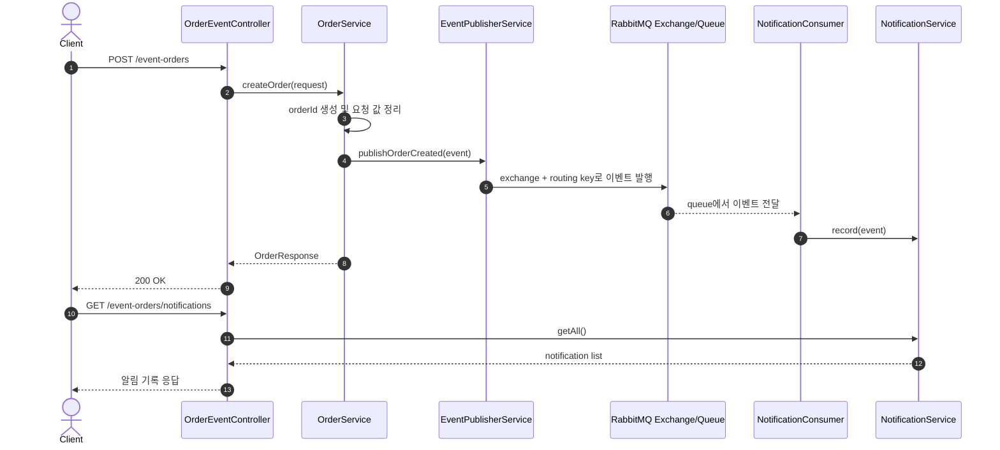
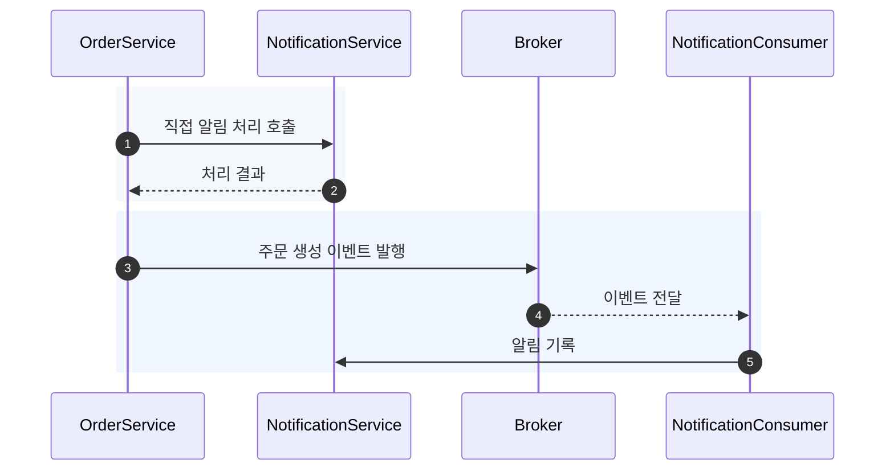

# 이론 정리

> 이번 시퀀스는 `POST /event-orders`로 주문 생성 결과를 만들고, 그 결과를 이벤트로 발행한 뒤, 소비자가 알림 기록으로 연결하는 흐름을 다룹니다. 목표는 메시징 운영 전체가 아니라 동기 호출과 이벤트 전달의 책임 차이를 이해하는 것입니다.

## 1. Problem - 왜 이벤트 기반 사고가 필요한가

처음에는 주문 생성 메서드가 알림 처리 메서드를 직접 호출해도 흐름이 단순합니다. 하지만 주문 생성 뒤 알림, 로그, 분석, 포인트 적립 같은 후속 작업이 늘어나면 주문 흐름이 여러 작업의 세부 구현을 알게 됩니다.

이렇게 되면 주문 생성이 실패한 것인지, 후속 알림 처리가 실패한 것인지, 어디까지 같은 트랜잭션으로 봐야 하는지 설명하기 어려워집니다. 서비스가 나뉘는 환경에서는 한 서비스의 배포나 장애가 다른 서비스의 요청 처리 흐름까지 끌고 들어올 수 있습니다.

이번 시퀀스에서는 주문 생성 결과를 `OrderCreatedEvent`라는 메시지로 표현하고, 발행자와 소비자를 나누어 후속 작업 결합을 줄이는 사고 방식을 연습합니다.

## 2. Analyze - 어떤 기준으로 직접 호출과 이벤트 전달을 나눌 것인가

직접 호출과 이벤트 전달은 어느 하나가 항상 더 좋은 방식이 아닙니다. 요청자가 즉시 결과를 알아야 하고 실패를 같은 흐름에서 처리해야 한다면 직접 호출이 더 단순합니다. 반대로 요청 결과를 다른 흐름이 나중에 처리해도 되고, 후속 작업이 늘어날 가능성이 높다면 이벤트 전달을 검토할 수 있습니다.

| 판단 기준 | 직접 호출이 어울리는 경우 | 이벤트 전달을 검토하는 경우 |
|---|---|---|
| 응답 필요성 | 호출자가 결과를 즉시 알아야 합니다. | 후속 작업 결과가 현재 응답에 직접 필요하지 않습니다. |
| 책임 경계 | 같은 기능 안에서 함께 끝나야 합니다. | 주문 생성과 알림 기록처럼 책임을 분리할 수 있습니다. |
| 장애 영향 | 후속 작업 실패가 요청 실패여야 합니다. | 후속 작업 실패를 별도 보상이나 재처리로 다룰 수 있습니다. |
| 확장 가능성 | 후속 작업이 적고 변경 가능성이 낮습니다. | 소비자가 늘거나 정책이 독립적으로 바뀔 가능성이 있습니다. |

이번 실습은 실제 분산 트랜잭션이나 재처리 전략을 완성하지 않습니다. 대신 발행자, 메시지 큐, 소비자의 역할을 나누고 트랜잭션 경계에서 어떤 질문이 생기는지 확인합니다.

## 3. API / 실행 시퀀스 다이어그램

### 3.1 API 실행 흐름

`POST /event-orders` 응답은 주문 생성 결과를 돌려줍니다. 알림 기록은 소비자가 이벤트를 처리한 뒤 `GET /event-orders/notifications`에서 확인합니다. 테스트에서는 실제 브로커를 항상 띄우기보다 `RabbitTemplate` 호출과 소비자 동작을 분리해서 확인할 수 있습니다.

### 3.2 동기 직접 호출과 이벤트 전달 비교

직접 호출은 추적이 쉽지만 주문 서비스가 알림 처리 방식을 알게 됩니다. 이벤트 전달은 흐름이 한 단계 늘어나지만 주문 서비스가 후속 작업 세부 구현을 직접 알 필요를 줄입니다.

## 4. 계층 / DTO / 메시지 흐름

### 4.1 계층 흐름

```mermaid
flowchart LR
    Client[Client] --> Controller[OrderEventController]
    Controller --> OrderService[OrderService]
    OrderService --> EventDTO[OrderCreatedEvent]
    EventDTO --> Publisher[EventPublisherService]
    Publisher --> Exchange[order.events]
    Exchange --> Queue[notification.order-created]
    Queue --> Consumer[NotificationConsumer]
    Consumer --> NotificationService[NotificationService]
    NotificationService --> NotificationDTO[NotificationMessageResponse]
```

| 계층 | 주요 타입 | 책임 |
|---|---|---|
| API 경계 | `OrderCreateRequest`, `OrderResponse` | 주문 생성 요청을 받고 현재 요청의 응답을 반환합니다. |
| 도메인 흐름 | `OrderService` | 주문 id를 만들고 주문 생성 결과를 이벤트로 표현합니다. |
| 이벤트 메시지 | `OrderCreatedEvent` | 후속 알림 흐름에 필요한 최소 사실을 전달합니다. |
| 발행 경계 | `EventPublisherService` | exchange와 routing key를 사용해 이벤트를 브로커로 보냅니다. |
| 소비 경계 | `NotificationConsumer` | queue에서 이벤트를 받아 후속 알림 기록으로 연결합니다. |
| 조회 응답 | `NotificationMessageResponse` | 소비 결과를 API 응답으로 확인할 수 있게 만듭니다. |

### 4.2 DTO와 메시지 구분

| 타입 | 이동 방향 | 담아야 할 내용 | 담지 말아야 할 내용 |
|---|---|---|---|
| `OrderCreateRequest` | Client -> API | 주문 생성에 필요한 입력 | 이벤트 처리 방식 |
| `OrderResponse` | API -> Client | 현재 요청의 주문 생성 결과 | 알림 소비 내부 상태 |
| `OrderCreatedEvent` | Producer -> Broker -> Consumer | 주문이 생성되었다는 사실과 후속 처리 최소 정보 | 알림 처리 로직, 소비자 전용 정책 |
| `NotificationMessageResponse` | API -> Client | 소비자가 기록한 알림 결과 | 브로커 설정이나 routing key |

이벤트는 명령 객체가 아니라 "이미 일어난 사실"을 전달하는 메시지입니다. 소비자가 어떤 방식으로 처리할지는 소비자 쪽 책임으로 남겨야 발행자와 소비자의 결합이 줄어듭니다.

## 5. Action - 구현에서 연결할 지점

### 5.1 `OrderCreatedEvent`에 최소 필드만 둡니다

이벤트에는 주문 id, 사용자 id, 상품명, 메시지처럼 후속 알림 흐름이 이해할 수 있는 정보만 둡니다. 이벤트 필드가 많아질수록 소비자가 발행자의 내부 모델에 의존하기 쉬우므로, 이번 단계에서는 알림 기록에 필요한 범위로 제한합니다.

확인 질문:

- 소비자가 알림을 만들기 위해 꼭 필요한 값은 무엇인가요?
- 이벤트에 처리 순서나 알림 정책을 넣고 있지는 않나요?
- 요청 DTO를 그대로 이벤트로 넘기고 있지는 않나요?

### 5.2 `EventPublisherService`는 발행만 맡습니다

발행 서비스는 `RabbitTemplate`을 사용해 exchange와 routing key로 이벤트를 보냅니다. 이 계층에서 알림 기록을 직접 수행하면 발행자와 소비자 분리가 약해집니다.

확인 질문:

- 주문 생성 흐름은 이벤트 발행까지만 담당하나요?
- 발행 서비스가 소비자의 저장 방식이나 알림 정책을 알고 있지는 않나요?
- 발행 실패가 발생하면 현재 요청과 어떤 관계가 되는지 설명할 수 있나요?

### 5.3 `NotificationConsumer`는 소비와 후속 연결을 맡습니다

소비자는 queue에서 `OrderCreatedEvent`를 받고 `NotificationService`에 기록을 위임합니다. 같은 `orderId`는 한 번만 기록하고, 재시작 후에도 유지되는 멱등성과 재시도는 확장 주제로 남깁니다.

확인 질문:

- 소비자가 주문 생성 로직을 다시 수행하지 않나요?
- 소비 결과를 `GET /event-orders/notifications`로 확인할 수 있나요?
- 테스트에서 발행자와 소비자를 분리해서 검증할 수 있나요?

## 6. Result - 무엇을 확인하고 어떤 한계가 남는가

이번 시퀀스를 마치면 다음을 설명할 수 있어야 합니다.

- 동기 직접 호출과 이벤트 전달의 차이
- `OrderCreatedEvent`가 요청 DTO나 응답 DTO와 다른 이유
- 발행자, 메시지 큐, 소비자가 각각 맡는 책임
- 주문 생성 성공과 이벤트 발행 실패 사이의 트랜잭션 경계 질문
- RabbitMQ가 없어도 단위 테스트로 확인할 수 있는 범위와 실제 실행으로 확인해야 하는 범위

남는 한계도 명확히 둡니다. 이번 시퀀스는 인메모리 `orderId` 중복 방지만 구현하며, 영속 멱등성, 재처리, dead letter queue, outbox pattern, 분산 트랜잭션은 구현하지 않습니다.

## 7. 실무 포인트

- 이벤트 이름은 `OrderCreatedEvent`처럼 과거형 사실을 표현하면 소비자가 명령처럼 오해할 가능성이 줄어듭니다.
- 이벤트 payload는 후속 처리에 필요한 최소 정보만 담습니다. 발행자의 내부 엔티티 전체를 넘기면 변경 영향이 커집니다.
- 발행 성공과 데이터 저장 성공이 항상 함께 보장되는 것은 아닙니다. 실제 서비스에서는 outbox, 재시도, 보상 처리 같은 전략을 검토합니다.
- 메시지 큐는 결합도를 낮출 수 있지만 운영 대상이 하나 더 생깁니다. 모니터링, 재처리, 중복 처리 방지가 필요합니다.
- 테스트는 발행 호출, 소비자 처리, API 조회를 나누어 봅니다. 모든 테스트가 실제 RabbitMQ에 의존하면 피드백 속도가 느려질 수 있습니다.

## 8. 용어 정리

`Event`
: 시스템에서 이미 일어난 일을 표현하는 메시지입니다. 이번 예시에서는 주문 생성 사실을 뜻합니다.

`Producer`
: 이벤트를 만드는 쪽입니다. 이번 흐름에서는 주문 생성 결과를 발행하는 서비스가 producer 역할을 합니다.

`Consumer`
: 이벤트를 받아 후속 작업을 수행하는 쪽입니다. 이번 흐름에서는 알림 기록을 남기는 소비자가 consumer 역할을 합니다.

`Message Broker`
: producer와 consumer 사이에서 메시지를 전달하는 중간 장치입니다. 이번 실습에서는 RabbitMQ를 사용합니다.

`Exchange`
: RabbitMQ에서 메시지를 받아 routing key 기준으로 queue에 전달하는 라우팅 지점입니다.

`Queue`
: consumer가 가져갈 메시지가 쌓이는 공간입니다.

`Routing Key`
: exchange가 메시지를 어느 queue로 보낼지 판단할 때 사용하는 값입니다.

`Payload`
: 메시지에 담겨 실제로 전달되는 데이터입니다. 이벤트 payload는 필요한 최소 사실을 담는 것이 좋습니다.

`Idempotency`
: 같은 이벤트가 여러 번 처리되어도 결과가 깨지지 않게 만드는 성질입니다. 이번 시퀀스에서는 개념만 언급하고 구현하지 않습니다.

`Outbox Pattern`
: DB 저장과 이벤트 발행 사이의 불일치를 줄이기 위한 패턴입니다. 이번 시퀀스에서는 확장 주제로 남깁니다.

## 9. 다음 구현으로 연결되는 지점

구현으로 넘어갈 때는 먼저 이벤트가 담아야 할 최소 정보를 말로 정리합니다. 그 다음 주문 생성 흐름이 이벤트를 발행하는지, 소비자가 알림 기록으로 연결하는지, API와 테스트로 흐름을 확인할 수 있는지 순서대로 확인합니다.

멘토용 설명 포인트

- 이벤트 기반 구조를 모든 상황의 해법으로 설명하지 않고, 직접 호출이 더 단순한 경우도 함께 비교합니다.
- 멘티가 먼저 `주문 생성 -> 이벤트 발행 -> 알림 소비` 흐름을 말로 설명하게 한 뒤 파일 역할을 연결합니다.
- 힌트는 이벤트 payload, 발행자 책임, 소비자 책임 순서로 제공합니다.
- 발행 실패와 주문 생성 성공이 갈라질 수 있다는 질문을 던지되, 운영 패턴 구현으로 범위를 넓히지는 않습니다.

