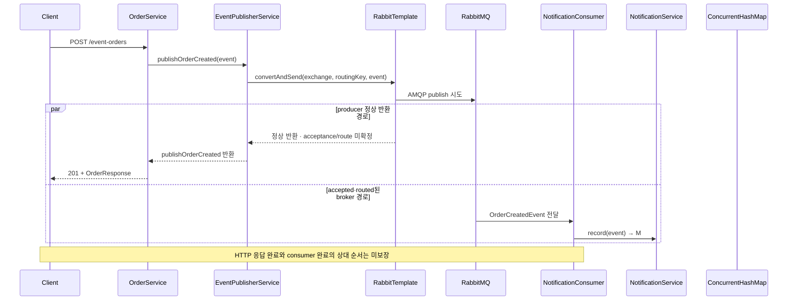

<a id="seq-12"></a>

# 이벤트 기반 사고 확장

## 1. 주문 응답과 후속 작업을 같은 흐름에 둘까?

후속 작업이 하나이고 즉시 결과가 필요하면 직접 호출이 더 단순합니다.
알림, 로그, 분석처럼 후속 책임이 늘어날 때는 주문 흐름이 각 구현을 직접 알지 않도록 생성 사실을 event로 전달할 수 있습니다.

현재 구현은 `OrderCreatedEvent`를 RabbitMQ로 보내고 알림 consumer가 별도 책임에서 처리합니다.



| 단계 | 들어온 것 | 한 일 | 나간 것 또는 상태 |
|---|---|---|---|
| 공통 | 주문 요청 | `AtomicLong`으로 id를 만들고 값을 정리 | `OrderCreatedEvent` 준비 |
| 공통 | exchange, routing key, event | `convertAndSend` 호출과 AMQP publish 시도 | producer continuation과 broker 경로가 독립적으로 진행 |
| Producer | `convertAndSend` 정상 반환 | `OrderResponse` 생성 후 Controller가 응답 | `201 + OrderResponse` · acceptance는 미확정 |
| Broker | accepted·routed된 queue event | consumer가 event를 받아 `record(event)` 호출 | 현재 process의 `ConcurrentHashMap`에 알림 한 건 |

HTTP 응답은 publisher 호출의 정상 반환까지 기다리지만 broker 이후 consumer 완료까지 기다리지는 않습니다. 정상 반환도 publisher confirm이 없는 현재 설정에서는 broker acceptance, queue route, consumer 완료를 확정하지 않습니다. 응답 반환과 consumer 완료 중 어느 쪽이 먼저 관찰될지도 보장하지 않습니다.

## 2. 발행 경계와 소비 경계는 따로 실패합니다

Publisher의 책임은 exchange와 routing key로 event를 보내는 데서 끝납니다.

```kotlin
fun publishOrderCreated(event: OrderCreatedEvent) {
    rabbitTemplate.convertAndSend(exchangeName, routingKey, event)
}
```

호출 전에는 event가 producer 메모리에 있고, 정상 반환 뒤에는 client-side 전송 호출이 예외 없이 끝난 상태입니다. 이것만으로 broker acceptance나 queue 저장을 증명하지 않습니다.
`convertAndSend`가 예외를 던지면 `OrderService`는 응답 반환까지 도달하지 않습니다. 다만 generic 예외는 실패 시점이 명확하지 않아 broker·queue 미도달을 확정할 수 없습니다. message conversion처럼 send 이전 실패임을 별도로 확인한 경우에만 미전송으로 좁힐 수 있습니다. 현재 예제는 publisher confirm, 영속 주문, outbox, retry, 보상을 제공하지 않습니다.

Consumer는 event를 자기 상태로 기록합니다.

```kotlin
notifications.putIfAbsent(
    event.orderId,
    NotificationMessageResponse(
        orderId = event.orderId,
        userId = event.userId,
        message = "주문 ${event.orderId}번(${event.productName})이 생성되었습니다."
    )
)
```

첫 전달 전에는 해당 `orderId`가 없고, 기록 뒤에는 현재 `ConcurrentHashMap`에 알림 한 건이 남습니다.
같은 event를 다시 받아도 같은 process에서는 한 건을 유지하지만 재시작하거나 instance가 나뉘면 이 map은 공유되지 않습니다.

Consumer의 `record(event)`가 실패해도 HTTP 요청 흐름과 같은 call stack에서 처리되는 것이 아닙니다. 당시 HTTP 응답이 이미 반환됐는지와 consumer 실패가 먼저 관찰됐는지는 실행 timing에 따라 달라질 수 있습니다. 현재 설정과 테스트만으로 retry, DLQ, 재전달 여부를 단정하지 않습니다.

## 3. 증거 범위를 나눠 읽습니다

```bash
docker compose up -d
./gradlew test
./gradlew bootRun
```

Publisher 단위 테스트는 `RabbitTemplate.convertAndSend` 호출만 확인합니다. Consumer 단위 테스트는 HTTP를 거치지 않고 `consumeOrderCreated(event)`를 직접 호출한 뒤 `NotificationService.getAll()`을 읽습니다.
실제 broker route와 queue 전달은 live RabbitMQ·애플리케이션 왕복으로, POST 응답 뒤 GET 알림 조회는 그 결과를 보는 수동 간접 증거로 별도 확인해야 합니다.

직접 호출과 event 전달 중 어느 쪽도 항상 정답은 아닙니다.
응답이 즉시 후속 결과를 필요로 하는지, 실패를 어디서 관찰하고 복구할지, 중복 상태를 얼마나 오래 유지할지로 선택합니다.

[Visual Lab에서 입력 조건을 보고 경로 예측하기](./visual-lab/sequences/12/)
